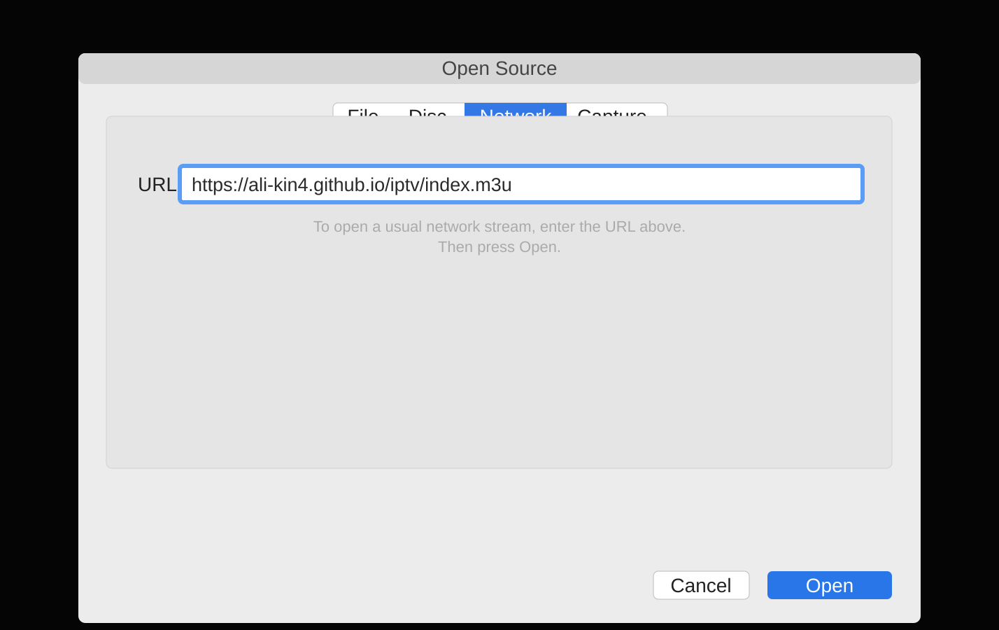

# IPTV — Ali Jabbary Fork

[](https://github.com/ali-kin4/iptv/actions/workflows/fork-build.yml)
[](https://github.com/ali-kin4/iptv/actions/workflows/fork-health.yml)

A maintained, provenance-first fork of [iptv-org/iptv](https://github.com/iptv-org/iptv). It keeps the upstream project synchronized while adding a separate validation and research layer for additional publicly available streams.

> **Upstream credit:** the base project, database model, generator, and the majority of inherited stream data come from [iptv-org/iptv](https://github.com/iptv-org/iptv). Fork-specific additions are maintained separately and must pass this fork's provenance and technical checks.

## 📺 Main playlist

Use this URL in VLC, Kodi, IPTV players, or any player that supports M3U network playlists:

```
https://raw.githubusercontent.com/ali-kin4/iptv/generated/index.m3u
```

The original upstream playlist is:

```
https://iptv-org.github.io/iptv/index.m3u
```

Other generated playlists are listed in [PLAYLISTS.md](PLAYLISTS.md).

## 🚀 How to use

In VLC:

1. Open **File → Open Network** / **Media → Open Network Stream**.
2. Paste `https://raw.githubusercontent.com/ali-kin4/iptv/generated/index.m3u`.
3. Press **Open / Play**.



## 🛡️ What this fork adds

- **Provenance-first acceptance:** a working URL is not automatically considered suitable for inclusion.
- **Technical stream validation:** real GET requests, redirects, HLS manifest parsing, media-segment probes, duplicate checks, and detection of obvious tokenized/credentialed URLs.
- **Fail-closed behavior:** unsupported or insufficiently validated stream types are not promoted automatically.
- **Overlay architecture:** fork-specific accepted streams live in `fork/accepted.jsonl` instead of permanently modifying upstream stream files as the source of truth.
- **Research ledger:** candidates and rejected/held sources are tracked separately under `research/`.
- **Automated health checks:** accepted custom streams are revalidated by GitHub Actions.
- **Fork-only builds:** generated playlists publish to this fork's normal `generated` branch; GitHub Pages is not required.
- **Safe upstream sync:** upstream changes are brought in through a reviewable synchronization workflow rather than silently force-updating the default branch.

See [Fork Architecture](docs/fork-architecture.md) and [Provenance Policy](docs/provenance-policy.md) for details.

## 🔄 Updates and synchronization

The fork tracks [iptv-org/iptv](https://github.com/iptv-org/iptv) as upstream. The synchronization workflow is documented in [docs/upstream-sync.md](docs/upstream-sync.md).

Generated public playlists are rebuilt from the current repository state, sanitized for obvious tokenized/credential-style URLs, and published to the normal `generated` branch for direct raw-file access.

## 🧪 Adding fork-specific streams

Research candidates belong in `research/candidates.jsonl`.

A stream should only be promoted to `fork/accepted.jsonl` when:

- the channel/feed mapping is valid;
- the source is demonstrably official or an authorized distributor;
- the URL is not dependent on private credentials, DRM circumvention, or short-lived session/token material;
- the live manifest and media data pass technical validation;
- the stream is not already represented by an equivalent accepted/upstream entry.

This fork does **not** use DRM bypasses, stolen/private credentials, account harvesting, or authentication circumvention.

## 🗓 EPG, database, and API

The project continues to use the upstream ecosystem:

- **EPG:** [iptv-org/epg](https://github.com/iptv-org/epg)
- **Channel database:** [iptv-org/database](https://github.com/iptv-org/database)
- **API:** [iptv-org/api](https://github.com/iptv-org/api)
- **Player/resources list:** [iptv-org/awesome-iptv](https://github.com/iptv-org/awesome-iptv)

Metadata corrections that belong to the shared upstream database should still be contributed there.

## 🛠 Contribution

For upstream-compatible stream changes, read the inherited [Contributing Guide](CONTRIBUTING.md).

For this fork's additional pipeline, also follow:

- [Fork Architecture](docs/fork-architecture.md)
- [Provenance Policy](docs/provenance-policy.md)
- [Personal Fork Notes](docs/personal-fork.md)

## ⚖ Legal

No video files are stored in this repository. It contains links and metadata for network streams.

The fork-specific policy intentionally requires stronger provenance evidence before custom additions are promoted. If a link is believed to infringe rights, it can be reported through this repository's issue tracker; removing a playlist link does not remove the remotely hosted content itself.

The inherited upstream project has its own legal and contribution processes at [iptv-org/iptv](https://github.com/iptv-org/iptv).

## © License

[](LICENSE)
